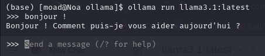
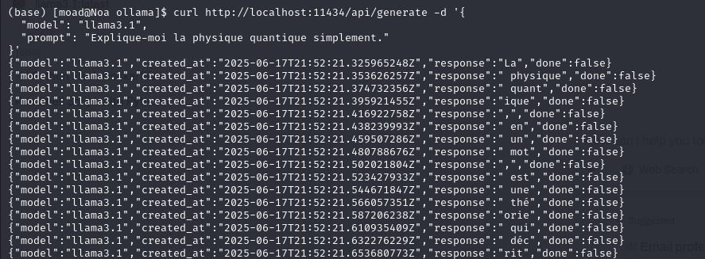

# Introduction


Ce projet a pour objectif de mettre en place une solution d'intelligence artificielle générative en auto-hébergement. Il s'appuie sur deux composants principaux :

- Ollama : un outil permettant de télécharger, gérer et exécuter localement des modèles de langage (LLMs).

- Open WebUI : une interface web moderne et intuitive pour interagir avec ces modèles en toute simplicité.

Cette plateforme permet à un utilisateur de poser des questions en langage naturel et d'obtenir des réponses cohérentes, contextuelles, et intelligentes, sans dépendre de services cloud externes.

## Qu'est-ce qu'un LLM ?

Un LLM (ou modèle de langage à grande échelle) est un modèle d’intelligence artificielle entraîné sur d’énormes volumes de texte. Ces modèles apprennent les structures, relations, et significations dans le langage humain. Une fois entraîné, un LLM est capable de :

- Comprendre et générer du texte en langage naturel

- Répondre à des questions, traduire des textes, résumer des documents

- Simuler une conversation naturelle, écrire du code, etc.

Les modèles les plus connus aujourd'hui sont GPT-3, GPT-4, LLaMA (Meta), Mistral, etc. Ces modèles contiennent des milliards de paramètres : ce sont des fonctions mathématiques ajustées pendant l'entraînement pour prédire le mot suivant dans une phrase.

Par exemple :

**Entrée** : *"Le ciel est bleu parce que..."*

**Sortie :** *"...la lumière du soleil est diffusée par l’atmosphère terrestre."*

## Pourquoi utiliser Ollama et Open WebUI ?

Ollama permet d'exécuter localement les LLMs, sans envoyer vos données vers un serveur distant.

Open WebUI fournit une interface élégante pour discuter avec ces modèles, comparable à ChatGPT, mais auto-hébergée, respectueuse de la vie privée et entièrement personnalisable.

Ce projet est donc une alternative locale, libre et extensible aux assistants IA disponibles sur Internet.

## Où sont stockées les données ?

Ce projet est conçu pour **fonctionner entièrement en local**, garantissant ainsi **la confidentialité totale des données** :

- **Les modèles sont stockés sur la machine locale**, dans le dossier `~/.ollama`.
- **Les historiques de conversation sont enregistrés dans le volume Docker d'Open WebUI**, accessible uniquement par l'utilisateur du système.
- Aucune donnée n’est envoyée vers des serveurs distants, sauf configuration explicite.

Ainsi, toutes les interactions avec les modèles d'IA sont **privées, sécurisées, et sous ton contrôle total**.


## Environnement de déploiement – Machine Virtuelle

Pour garantir de bonnes performances à l’**IA générative auto-hébergée**, ce projet a été déployé sur une **machine virtuelle (VM)** puissante, optimisée pour l’exécution de modèles LLM locaux, notamment ceux proposés via **Ollama**.

### Spécifications techniques de la VM

| Ressource       | Détail                        |
|------------------|-------------------------------|
|  Processeurs    | 16 cœurs                      |
|  Mémoire RAM    | 50 Go                         |
|  Stockage SSD  | 500 Go                        |
|  GPU           | NVIDIA L4 avec 24 Go de VRAM  |
|  Adresse IP     | `159.31.247.122`              |

Cette configuration permet :

-  Le **chargement rapide** et **l’inférence fluide** de modèles de langage volumineux (ex : LLaMA3, Mistral, etc.)
-  Une **installation 100% locale** sans compromis sur les performances
-  Le **support GPU (CUDA)** pour l’accélération des tâches d’inférence via la carte NVIDIA L4 (24 Go VRAM), indispensable pour des modèles LLM modernes

### Pourquoi ce choix de VM ?

Le choix de cette VM repose sur plusieurs critères clés pour une plateforme d'IA locale :

- **Compatibilité GPU avec Ollama et PyTorch** (accélération CUDA)
- **Mémoire suffisante** pour charger des modèles en RAM + VRAM sans swap
- **Stockage conséquent** pour accueillir plusieurs modèles (~2-10 Go chacun) et les historiques utilisateurs
- **Sécurité et isolation** : environnement dédié pour l’IA générative, sans interférence avec d'autres services


# Installation et configuration complète d'Ollama sur une VM Linux

## 1. Installation d’Ollama

### Étapes :

Téléchargement et installation d'Ollama dans notre VM rocky :

```bash
curl -fsSL https://ollama.com/install.sh | sh
```

Cela installe le binaire dans `/usr/local/bin/ollama`.


## 2. Démarrage propre d’Ollama

Une fois tous les processus terminés :

```bash
ollama serve
```

### Résultat attendu :

```log
Listening on 127.0.0.1:11434 (version 0.9.0)
...
inference compute GPU NVIDIA L4 OK
```

## (Optionnel) Lancer Ollama sur un autre port

Si le port 11434 est occupé ou si tu veux éviter les conflits :

```bash
OLLAMA_HOST=127.0.0.1:11435 ollama serve
OLLAMA_HOST=0.0.0.0:11435 ollama serve 
```

## Remarques

- Un processus `ollama serve` se lance automatiquement via un mécanisme (peut-être `systemd` ou un autre service de fond).
- Il tourne avec l'utilisateur `ollama`.
- La méthode `pkill -f ollama` permet de le tuer efficacement, mais il revient si un service l’autostart.
- À long terme, il faudra identifier et désactiver le service systemd correspondant pour avoir le contrôle total.


## 3. Téléchargement du modèle : 

Pour importer le modèle localement : 

```bash
ollama pull llama3
```

Exemples de modèles disponibles :


| Nom du modèle       | Commande pull                 |
| ------------------- | ----------------------------- |
| LLaMA 3.1 (8B)        | `ollama pull llama3.1`          |
| Mistral             | `ollama pull mistral`         |
| Gemma               | `ollama pull gemma`           |
| Codellama           | `ollama pull codellama`       |
| Phi-2               | `ollama pull phi`             |
| Dolphin (finetuned) | `ollama pull dolphin-mixtral` |


Par défaut, les modèles sont stockés localement dans le répertoire ~/.ollama. Leur taille peut varier selon le modèle utilisé ; à titre d’exemple, LLAMA3.1 occupe environ 4,9 Go, tandis que Mistral pèse environ 4,1 Go.

## 4. Lancer le modèle pour dialoguer 

Une fois le modèle téléchargé :

```bash
ollama run llama3.1:latest
```
Vous pouvez alors entrer vos prompts directement dans le terminal :




## 5. Tester une requête via l'API

Ollama expose une API REST locale. Exemple avec curl :


```bash
curl http://localhost:11434/api/generate -d '{
  "model": "llama3",
  "prompt": "Explique-moi la physique quantique simplement."
}'
```

Réponse : JSON contenant le texte généré par le modèle 




##  6. Liste des modèles installés localement 

```bash
ollama list
```


## 7. Supprimer un modèle

```bash
ollama rm mistral
```


# Installation de l'interface web Open WebUI 

## Présentation


**Open WebUI** est une interface web moderne, intuitive et open source qui permet d’interagir facilement avec des **modèles de langage (LLMs)** comme ceux gérés par **Ollama**.  
Elle fournit un environnement conversationnel (chatbot) semblable à ChatGPT, mais **entièrement local** et **personnalisable**.

Open WebUI est souvent déployée en conteneur Docker et communique avec Ollama via une API locale (`http://localhost:11434`).

## Méthodes d'installation : Docker vs installation locale 

Il existe deux méthodes principales pour installer Open WebUI : via Docker ou en installation locale directe. L’approche avec Docker est idéale pour une mise en route rapide et encapsulée, car elle permet d’exécuter l’application dans un conteneur isolé, sans dépendre de la configuration de l’environnement hôte. C’est une solution robuste, simple à déployer, et adaptée pour des environnements de production. En revanche, l’installation locale (via git clone) offre une plus grande flexibilité pour les développeurs souhaitant modifier le code source, personnaliser l’interface, ou interagir plus directement avec les composants frontend et backend. Elle est aussi plus légère en ressources si l’environnement de développement est bien configuré, mais demande davantage de configuration initiale (Python, Node.js, environnements virtuels).

## Installation via Docker

### 1. Créer un fichier `docker-compose.yml` :

```yaml
version: '3.8'
services:
  webui:
    image: ghcr.io/open-webui/open-webui:main
    container_name: open-webui
    ports:
      - 3000:8080
    volumes:
      - open-webui-data:/app/backend/data
      - /home/moad/.ollama/models/manifests/registry.ollama.ai/library/llama3.1
    environment:
      - OLLAMA_API_BASE_URL=http://172.17.0.1:11434
    restart: unless-stopped

volumes:
  open-webui-data:
```

### Remarque : 

172.17.0.1 est l’adresse IP que Docker utilise pour accéder à l’hôte depuis un conteneur sous Linux.

### 2. Lancer le service

```bash
docker compose up -d
```

### 3. Accèder à l'interface WEB :

Depuis un navigateur : http://localhost:3000


**Voici les fonctionnalités principales :** 

Chat multi-modèles ( on peut facilement basculer entre llama3, mistral, etc.).

Historique des conversations (stocké localement).

Prise en charge des modèles personnalisés.

UI légère basée sur SvelteKit.


**Où sont stockées les données ?**

- Les données utilisateurs (chats, préférences, etc.) sont dans le volume Docker : 

```bash
/app/backend/data
```
Les fichiers statiques (images, favicon, etc.) sont dans :

```bash
/app/static
```


## Installation avec Git Clone 


### Prérequis

Avant de commencer, il faut s'assurer que notre machine répond aux exigences suivantes :

- **Système d’exploitation** : Linux, macOS, ou Windows 11 avec WSL
- **Python** : 3.11 ou plus
- **Node.js** : 22.10 ou plus
- **Conda** (recommandé) : pour isoler les environnements Python
- **npm** : pour gérer les dépendances frontend
- **VSCode (recommandé)** : pour une expérience de développement optimale
- **GitHub Desktop (optionnel)** : pour ceux qui préfèrent une interface graphique Git


### 1. Clonage du dépôt

```bash
git clone https://github.com/open-webui/open-webui.git
cd open-webui
```

### 2. Mise en place du Frontend

**Étape 1 : Copier le fichier .env**

```bash
cp -RPp .env.example .env
```

Ensuite, on peut éditer le fichier .env si on veut modifier des paramètres comme l’URL de l’API.


**Étape 2 : Installer les dépendances frontend**

```bash
npm install
```

**Étape 3 : Lancer le serveur de développement frontend**

```bash
npm run dev
```

On accède à http://localhost:5173 pour voir l'interface. Si le backend n'est pas encore lancé, un message nous indique qu’il est en attente ! donc c'est important de lancer le backend avant de lancer le front end.

### 3. Mise en place du Backend


Il nous faut un autre terminal pour garder les logs séparés du frontend.

**Étape 1 : Aller dans le dossier backend**

```bash
cd backend
```

**Étape 2 : Créer et activer un environnement Conda**

```bash
conda create --name open-webui python=3.11
conda activate open-webui
```

Si vous n’utilisez pas Conda, assurez-vous d’avoir Python 3.11+ actif.

**Étape 3 : Installer les dépendances Python**

```bash
pip install -r requirements.txt -U
```

**Étape 4 : Lancer le serveur backend**

```bash
sh dev.sh
```

Une fois lancé, on ouvre http://localhost:8080/docs pour consulter la documentation interactive de l'API backend via Swagger

Voici enfin la representation de l'arborescence du projet Open WEBUI en mode installation locale: 

```bash
open-webui/
├── backend/            # Serveur FastAPI
│   ├── app/
│   ├── dev.sh
│   └── requirements.txt
├── frontend/           # Interface utilisateur
├── .env
├── .env.example
├── package.json
└── README.md
```


